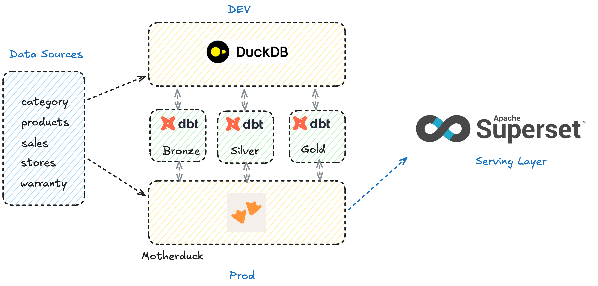
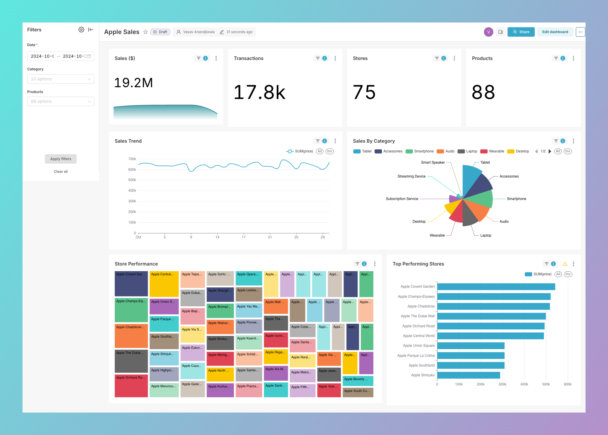

## Apple Sales Analytics

Stack:

- dbt
- python
- duckdb (Local)/ motherduck (Cloud)
- apache superset

## Architecture



- Data Source: Kaggle Apple Retail Analytics Dataset
- Transformations: DBT
- Compute Engine: Duckdb/motherduck
- Serving: Apache superset on preset.io

## Serving

Apache superset sample dashbord demo

- TODO: improve on drill down and add other detailed charts



## Data Modeling

Dimension modeling used to have the following tables in every layer of Medallion architecture. An OBT created for fast query and serving layer on the BI tool.

### Bronze

1. bronze_category
2. bronze_products
3. bronze_sales
4. bronze_stores
5. bronze_warranty

### Silver

1. silver_products (Joining products and category)
2. silver_sales
3. silver_stores
4. silver_warranty

### Gold

1. sales_fact

## Setting up project

I have kept both requirements.txt file and pyproject.toml file in the repo. So you can use either `uv` or `pip` based on your comfort.

- First step is to activate virtual env, installing all dependancies.
- Then first run the setup.py file which will do the initial load in the local duckdb instance. For production/motherduck, I have kept the code snippet.

## Query Data

- You can use query_data.py file to query and validate the data in the duckdb instance while developing.

## Important DBT Commands:

1. dbt init
2. dbt debug
3. dbt compile
4. dbt run
5. dbt docs generate
6. dbt docs serve

## Profile.yml for DBT

### Local

```
apple_retail_analytics:
  target: dev
  outputs:
    dev:
      type: duckdb
      path: "../data/apple-retail.db"
```

### Motherduck

Note: [Follow documentation for setting up motherduck token and env variable](https://motherduck.com/docs/key-tasks/authenticating-and-connecting-to-motherduck/authenticating-to-motherduck/)

```
apple_retail_analytics:
  target: dev
  outputs:
    dev:
      type: duckdb
      path: "md:apple-retail?motherduck_token={{env_var('MOTHERDUCK_TOKEN')}}"
```
